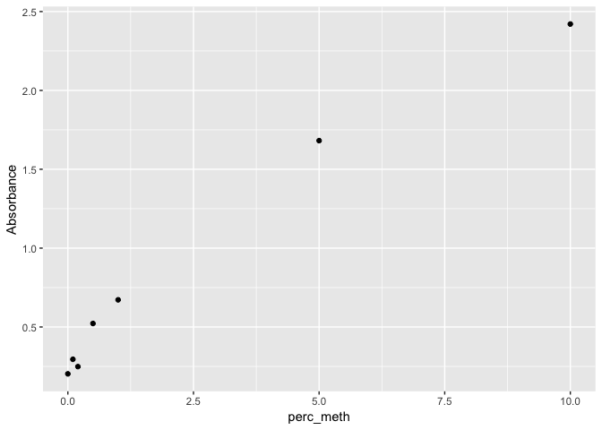
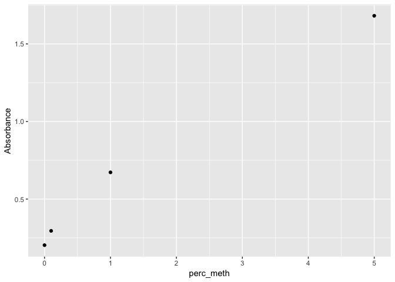
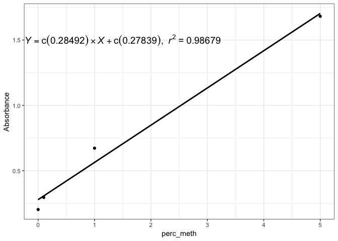
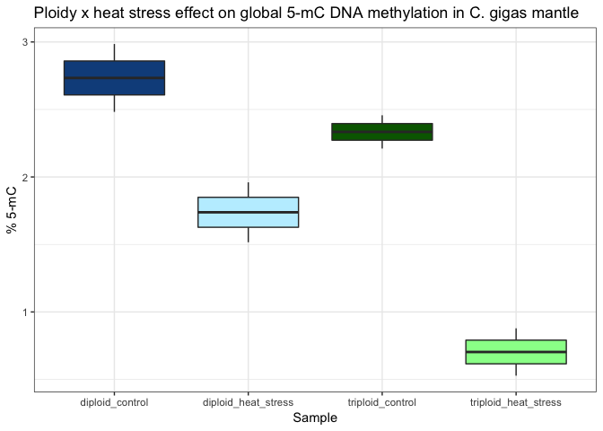

GlobalDNAMeth\_Polyploids\_pilot
================
Shelly Trigg
2/15/2019

``` r
library(readxl)
library(dplyr)
```

    ## 
    ## Attaching package: 'dplyr'

    ## The following objects are masked from 'package:stats':
    ## 
    ##     filter, lag

    ## The following objects are masked from 'package:base':
    ## 
    ##     intersect, setdiff, setequal, union

``` r
library(ggplot2)
library(broom)
```

Read in raw absorbance data files exported from plate reader. There are 3 files because I read the plate 3 independent times. The purpose for this was to make sure the readings were stable.

``` r
data1 <- read_xls("~/Documents/GitHub/C_gigas/Polyploids/docs/20181018_FirstReadingSTRIGG.xls")
data2 <- read_xls("~/Documents/GitHub/C_gigas/Polyploids/docs/20181018_2ndReadingSTRIGG.xls")
data3 <- read_xls("~/Documents/GitHub/C_gigas/Polyploids/docs/20181018_3rdReadingSTRIGG.xls")
```

Combine data frames into one data frame

``` r
Oct2018 <- merge(data1[,c(3,6)],data2[,c(3,6)], by = "Well")
Oct2018 <- merge(Oct2018,data3[,c(3,6)], by = "Well")
#simplify column names
colnames(Oct2018) <- c("Well", "Abs1", "Abs2", "Abs3")
```

Check that absorbance readings were stable

``` r
#calculate the mean reading for each of the three readings
Oct2018$mean <- apply(Oct2018[,2:4],1, mean)
#calculate the standard deviation for each of the three readings
Oct2018$sd <- apply(Oct2018[,2:4],1, sd)
#print the largest standard deviation
max(Oct2018$sd)
```

    ## [1] 0.02413396

**Stable readings conclusion:** SDs are very small (~0.02) between readings so go with readings from data1

Add sample info and exclude empty wells

``` r
#first read in sample names from plate map list
Oct_plateMap <- read_xlsx("~/Documents/GitHub/C_gigas/Polyploids/docs/MethylFlashGlobalDNAMethylation_20181017.xlsx", sheet = 3)

#make a list of samples to not be considered
rmv_wells <- c("no_sample")

#remove samples not to be considered from data frame
Oct_data <- merge(Oct_plateMap[which(!(Oct_plateMap$Sample %in% rmv_wells)),], data1[,c(3,6)])

#simplify absorbance column name
colnames(Oct_data)[4] <- "Absorbance"
```

Generate standard curve

``` r
#make new data frame with only data from standards (STDs)
curve <- Oct_data[grep("STD", Oct_data$Type),]
print(curve)
```

    ##    Well Type        Sample Absorbance
    ## 1   A01  STD            NC  0.2028378
    ## 4   B01  STD 2 ul 0.1 % PC  0.2951393
    ## 7   C01  STD 2 ul 0.2 % PC  0.2488261
    ## 10  D01  STD  2 ul 0.5% PC  0.5221935
    ## 13  E01  STD    2 ul 1% PC  0.6721374
    ## 15  F01  STD    2 ul 5% PC  1.6814825
    ## 17  G01  STD       2 ul PC  2.4208473

``` r
#make new column for %meth
curve$perc_meth <- c(0,0.1,0.2,0.5,1,5,10)
#order data by perc_meth
curve <- curve[order(curve$perc_meth),]
print(curve)
```

    ##    Well Type        Sample Absorbance perc_meth
    ## 1   A01  STD            NC  0.2028378       0.0
    ## 4   B01  STD 2 ul 0.1 % PC  0.2951393       0.1
    ## 7   C01  STD 2 ul 0.2 % PC  0.2488261       0.2
    ## 10  D01  STD  2 ul 0.5% PC  0.5221935       0.5
    ## 13  E01  STD    2 ul 1% PC  0.6721374       1.0
    ## 15  F01  STD    2 ul 5% PC  1.6814825       5.0
    ## 17  G01  STD       2 ul PC  2.4208473      10.0

plot curve

``` r
ggplot(curve, aes(perc_meth, Absorbance)) + geom_point() 
```



last point is plateauing. Removing points 10, 0.2 and 0.5 gives the best R2 value so remove them

``` r
ggplot(curve[-grep("0.2|0.5|10", curve$perc_meth),], aes(perc_meth, Absorbance)) + geom_point() 
```



find regression line

``` r
fit <- lm(curve[-grep("0.2|0.5|10", curve$perc_meth),"Absorbance"] ~ curve[-grep("0.2|0.5|10", curve$perc_meth),"perc_meth"] )
#find the R-squared
rsquared <- summary(fit)$r.squared
rsquared
```

    ## [1] 0.9867937

``` r
#find the slope (https://www.cyclismo.org/tutorial/R/linearLeastSquares.html)
slope <- fit$coefficients[[2]]
slope
```

    ## [1] 0.2849246

plot regression line with equation and r-squared

``` r
#found this site helpful: (https://www.listendata.com/2016/07/add-linear-regression-equation-and.html)
linear = function(k) {
  z <- list(xx = format(coef(k)[1], digits = 5),
            yy = format(abs(coef(k)[2]), digits = 5),
            r2 = format(summary(k)$r.squared, digits = 5));
  if (coef(k)[1] >= 0)  {
    eq <- substitute(italic(Y) == yy %*% italic(X) + xx*","~~italic(r)^2~"="~r2,z)
  } else {
    eq <- substitute(italic(Y) == yy %*% italic(X) - xx*","~~italic(r)^2~"="~r2,z)  
  }
  as.character(as.expression(eq));              
}

x <- curve[-grep("0.2|0.5|10", curve$perc_meth),"perc_meth"]
y <- curve[-grep("0.2|0.5|10", curve$perc_meth),"Absorbance"]
fo = y ~ x
linplot <- ggplot(data = curve[-grep("0.2|0.5|10", curve$perc_meth),], aes(x = perc_meth, y = Absorbance)) + geom_smooth(method = "lm", se=FALSE, color="black", formula = fo) +  geom_point() + theme_bw()
linplot1 = linplot + annotate("text", x = 1.5, y = 1.5, label = linear(lm(fo)), colour="black", size = 5, parse=TRUE)
linplot1
```



Calculate perc\_meth for samples using equation in EpiGentek MethylFlash kit manual: 5-mC% = (sample OD - NC OD) / (slope x input sample DNA in ng) \* 100%

``` r
#create an object for the absorbance of the NC (blank)
NC_OD <- Oct_data[grep("NC", Oct_data$Sample),"Absorbance"]
#create an object for amount of DNA added in each well
DNAamt <- 100
# create an object for product of the regression line slope and the ng DNA added in each of the wells
slopexDNAamt <- slope * DNAamt

#create a new column in the dataframe with the NC_OD subtracted from the avg absorbance
Oct_data$Absorbance_NC <- Oct_data$Absorbance - NC_OD
#create a new column with the calculated percent methylation
Oct_data$perc_meth <- Oct_data$Absorbance_NC/slopexDNAamt *100
```

Add ploidy and treatment info to data

``` r
### plot all %5-mC data together

Oct_data_all_samples <- Oct_data[which(Oct_data$Type == "Sample"),]
for (i in 1:nrow(Oct_data_all_samples)){
  if(grepl("D1|D2",Oct_data_all_samples$Sample[i])){
    Oct_data_all_samples$desc[i] <- "diploid_control"
  }
  if(grepl("D9|D10",Oct_data_all_samples$Sample[i])){
    Oct_data_all_samples$desc[i] <- "diploid_heat_stress"
  }
  if(grepl("T1|T2",Oct_data_all_samples$Sample[i])){
    Oct_data_all_samples$desc[i] <- "triploid_control"
  }
  if(grepl("T9|T10",Oct_data_all_samples$Sample[i])){
    Oct_data_all_samples$desc[i] <- "triploid_heat_stress"
  }
  if(grepl("4M$",Oct_data_all_samples$Sample[i])){
    Oct_data_all_samples$desc[i] <- "diploid_control"
  }
  if(grepl("4Ms",Oct_data_all_samples$Sample[i])){
    Oct_data_all_samples$desc[i] <- "diploid_muscle"
  }
  if(grepl("4C",Oct_data_all_samples$Sample[i])){
    Oct_data_all_samples$desc[i] <- "diploid_ctenidia"
  }
  if(grepl("4G",Oct_data_all_samples$Sample[i])){
    Oct_data_all_samples$desc[i] <- "diploid_gonad"
  }
  if(grepl("Sea lice",Oct_data_all_samples$Sample[i])){
    Oct_data_all_samples$desc[i] <- "Sea lice"
  }
}
###for box plot, plot heat stress vs. control diploid/triploid data only
#make new data frame with only sample info
Oct_data_Samples <- Oct_data[which(Oct_data$Type == "Sample" & substr(Oct_data$Sample,1,1) == "D" | Oct_data$Type == "Sample" & substr(Oct_data$Sample,1,1) == "T"),]

ggplot(Oct_data_all_samples, aes(x = desc, y = perc_meth)) + geom_point(aes(color = Sample)) + xlab("Sample") + theme_bw() + ylab("% 5-mC") + ggtitle("global 5-mC DNA methylation") + theme(axis.text.x = element_text(angle = 90, hjust = 1))
```


``` r
#Add sample description to data frame. This loops through each line in Oct_data_Samples and creates a new column 'ploidy' that gets filled in with "diploid" or "triploid" depending on whether the "Sample" name starts with a "D" or "T"; and creates a new column "treatment" that gets filled in with "heat_stress" or "control" depending on whether the number following the D or T is less than 10 or greater than 10. 
for (i in 1:nrow(Oct_data_Samples)){
  if(substr(Oct_data_Samples$Sample[i],1,1)=="D"){
    Oct_data_Samples$ploidy[i] <- "diploid"
  }
  if(substr(Oct_data_Samples$Sample[i],1,1)=="T"){
    Oct_data_Samples$ploidy[i] <- "triploid"
  }
  if(as.numeric(substr(Oct_data_Samples$Sample[i],2,3)) > 8){
    Oct_data_Samples$treatment[i] <- "heat_stress"
  }
  if(as.numeric(substr(Oct_data_Samples$Sample[i],2,3)) < 8){
    Oct_data_Samples$treatment[i] <- "control"
  }
}

#make a new column which contains both ploidy and treatment info 
Oct_data_Samples$condition <- paste(Oct_data_Samples$ploidy, Oct_data_Samples$treatment, sep = "_")
```

Plot absorbances vs. experimental group

``` r
ggplot(Oct_data_Samples, aes(x = condition, y = perc_meth)) + geom_boxplot(aes(fill = condition), show.legend = F) + scale_fill_manual(values = c("dodgerblue4", "lightblue1", "darkgreen", "palegreen")) + xlab("Sample") + theme_bw() + ylab("% 5-mC") + ggtitle("Ploidy x heat stress effect on global 5-mC DNA methylation in C. gigas mantle")
```



Perform an ANOVA test to see if ploidy, treatment, or their interaction has a signficant effect on % methylation at p \< 0.05.

``` r
#run anova
aov_2way <- aov(perc_meth ~ ploidy + treatment + ploidy:treatment, data = Oct_data_Samples)
#save the model summary as an object
aov_2way_model_summary <- glance(aov_2way)
#print the p.value
aov_2way_model_summary$p.value
```

    ## [1] 0.007375567

The p-value is significant at 0.05 so run a Tukey's HSD test to see which effect is significant

``` r
tuk <- TukeyHSD(aov(perc_meth ~ ploidy + treatment + ploidy:treatment, data = Oct_data_Samples))
tuk
```

    ##   Tukey multiple comparisons of means
    ##     95% family-wise confidence level
    ## 
    ## Fit: aov(formula = perc_meth ~ ploidy + treatment + ploidy:treatment, data = Oct_data_Samples)
    ## 
    ## $ploidy
    ##                        diff       lwr        upr    p adj
    ## triploid-diploid -0.7172103 -1.269538 -0.1648826 0.022652
    ## 
    ## $treatment
    ##                          diff       lwr        upr     p adj
    ## heat_stress-control -1.312708 -1.865036 -0.7603802 0.0027341
    ## 
    ## $`ploidy:treatment`
    ##                                                diff       lwr        upr
    ## triploid:control-diploid:control         -0.3995867 -1.544853  0.7456798
    ## diploid:heat_stress-diploid:control      -0.9950843 -2.140351  0.1501822
    ## triploid:heat_stress-diploid:control     -2.0299183 -3.175185 -0.8846518
    ## diploid:heat_stress-triploid:control     -0.5954976 -1.740764  0.5497688
    ## triploid:heat_stress-triploid:control    -1.6303316 -2.775598 -0.4850651
    ## triploid:heat_stress-diploid:heat_stress -1.0348340 -2.180100  0.1104325
    ##                                              p adj
    ## triploid:control-diploid:control         0.5499755
    ## diploid:heat_stress-diploid:control      0.0774530
    ## triploid:heat_stress-diploid:control     0.0067550
    ## diploid:heat_stress-triploid:control     0.2876381
    ## triploid:heat_stress-triploid:control    0.0150218
    ## triploid:heat_stress-diploid:heat_stress 0.0687549

**Conclusions: Effect of ploidy and heat stress on global 5-mC DNA methylation**
After running the stats I realized it's not really kosher to even do an ANOVA or Tukey's when we only have two data points for each boxplot.

But overall, diploid mantle shows higher methylation than triploid mantle. And there is a more dramatic decrease in global 5-mC methylation in response to heatstress in triploid than in diploid.
